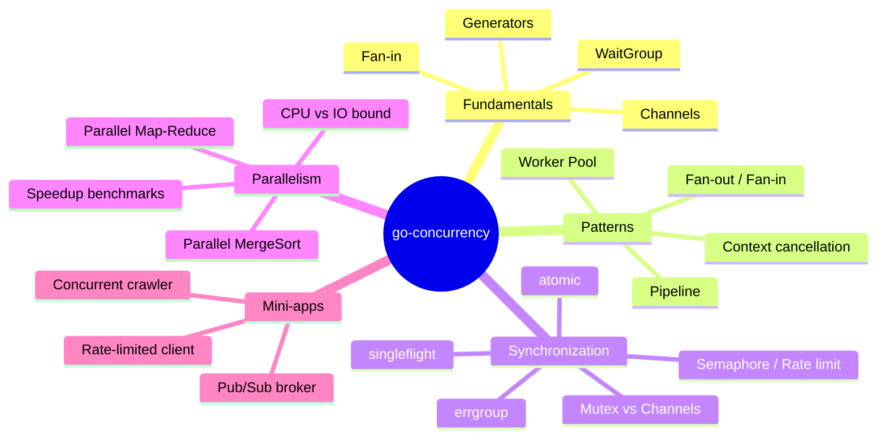

# go-concurrency

> A hands-on **Go** library and CLI for mastering **concurrency and parallelism**: canonical patterns and real mini-apps, every one tested under the **race detector** and checked for **goroutine leaks**.

[](https://github.com/alejandrogarsan89/go-concurrency/actions/workflows/ci.yml)


## Why this project?

Concurrency is where Go shines — and where subtle bugs hide. This repository is
a portfolio-quality showcase of doing it **correctly**:

- **Patterns as reusable, generic packages** — not throwaway snippets.
- **Race-free by construction** — CI runs every test with `-race`.
- **No goroutine leaks** — tests use [`goleak`](https://github.com/uber-go/goleak) to prove goroutines exit.
- **Context-aware** — everything cancellable honours `context.Context`.
- **Runnable in one command** — via `make`, `go run`, or Docker.

## Concurrency toolbox



> **Roadmap.** Phase 1 (fundamentals), phase 2 (worker pools & pipelines) and
> **phase 3 — synchronization primitives** are done. Later phases add real
> parallelism with speedup benchmarks and mini-applications.

## Quick start

```bash
# Requires Go 1.22+
go run ./cmd/demo waitgroup --tasks 8
go run ./cmd/demo generator --n 10 --take 3
go run ./cmd/demo fanin --sources 3 --per 4
go run ./cmd/demo pool --jobs 20 --workers 4
go run ./cmd/demo pipeline --n 12
go run ./cmd/demo once --goroutines 100
go run ./cmd/demo semaphore --tasks 20 --limit 3
go run ./cmd/demo group --tasks 5 --fail
go run ./cmd/demo singleflight --callers 100

# Or use the Makefile
make run ARGS="waitgroup --tasks 8"
make test        # tests with the race detector + coverage
make bench       # benchmarks

# Or run it in Docker (no local Go required)
make docker-build
make docker-run ARGS="fanin --sources 3 --per 4"
```

## Using the library

```go
import (
    "context"

    "github.com/alejandrogarsan89/go-concurrency/patterns/fanin"
    "github.com/alejandrogarsan89/go-concurrency/patterns/generator"
)

ctx := context.Background()
a := generator.FromSlice(ctx, []int{1, 2, 3})
b := generator.FromSlice(ctx, []int{4, 5, 6})

for v := range fanin.Merge(ctx, a, b) {
    // values from both channels, closed automatically when drained
    _ = v
}
```

## Contents

| Category | Item | What it teaches |
|----------|------|-----------------|
| Fundamentals | `waitgroup.RunAll`, `waitgroup.Map` | launch goroutines and wait with `sync.WaitGroup` |
| Fundamentals | `generator.Ints/FromSlice/Take` | channel generators with context cancellation |
| Fundamentals | `fanin.Merge` | merge many channels into one without leaking |
| Patterns | `pool.Process`, `pool.Map` | bounded worker pool (controlled parallelism) |
| Patterns | `pipeline.Map`, `pipeline.Filter` | multi-stage streaming pipeline |
| Synchronization | `once.Lazy` | compute a value once, share it safely |
| Synchronization | `semaphore.Semaphore` | cap concurrent access to a resource |
| Synchronization | `group.Group` | run tasks, cancel all on first error (errgroup-style) |
| Synchronization | `singleflight.Group` | collapse duplicate concurrent calls |

## Documentation

The [`docs/`](docs/) directory is a self-contained course on Go concurrency —
the theory underneath, the patterns built on it, and the judgement to apply them:

**Foundations — how Go concurrency actually works**
- [The Go Memory Model & `happens-before`](docs/memory-model.md) — data races, visibility, what channels/`sync`/atomics guarantee
- [The Go Scheduler (G-M-P)](docs/scheduler.md) — goroutines vs threads, `GOMAXPROCS`, work-stealing, preemption

**Patterns — reusable building blocks**
- [Overview & concurrency vs parallelism](docs/README.md)
- [Fundamentals: WaitGroup, generators, fan-in](docs/fundamentals.md)
- [Worker Pools & Pipelines](docs/pool-pipeline.md)
- [Synchronization Primitives](docs/synchronization.md)

**Practice — applying it correctly**
- [Pitfalls & Anti-Patterns](docs/pitfalls.md) — the classic bugs and their fixes
- [Choosing the Right Primitive](docs/decision-guide.md) — decision guide + cheat-sheet

## Project layout

```
go-concurrency/
├── cmd/demo/          # Cobra CLI to run the demos
├── patterns/          # reusable concurrency patterns (one package each)
├── apps/              # (later) mini-apps combining patterns
├── internal/          # shared helpers
├── docs/              # theory & diagrams per pattern
├── Makefile
├── Dockerfile
└── .github/workflows/ # CI (gofmt, vet, race tests, lint)
```

## Development

```bash
make help        # list all targets
make test        # go test -race -cover ./...
make lint        # golangci-lint run
make bench       # benchmarks
```

## License

[MIT](LICENSE)
