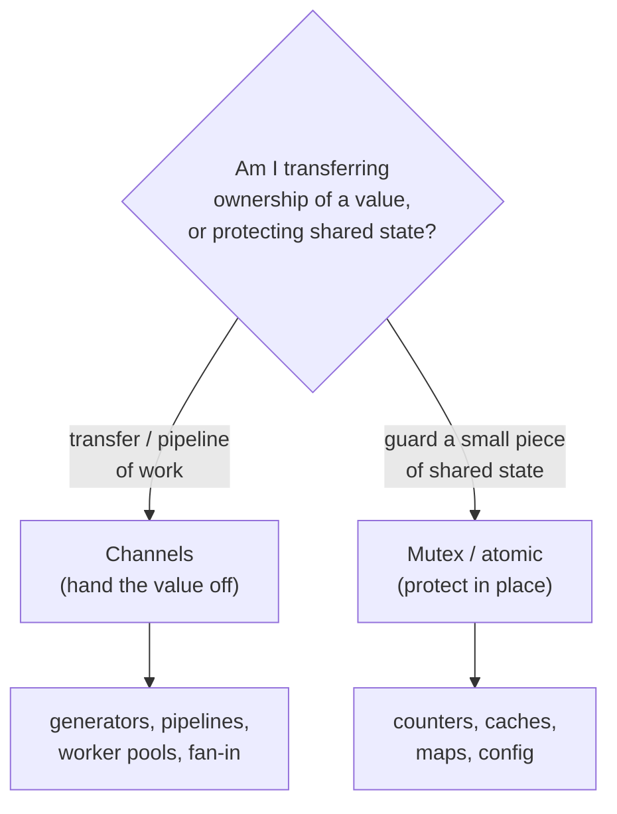
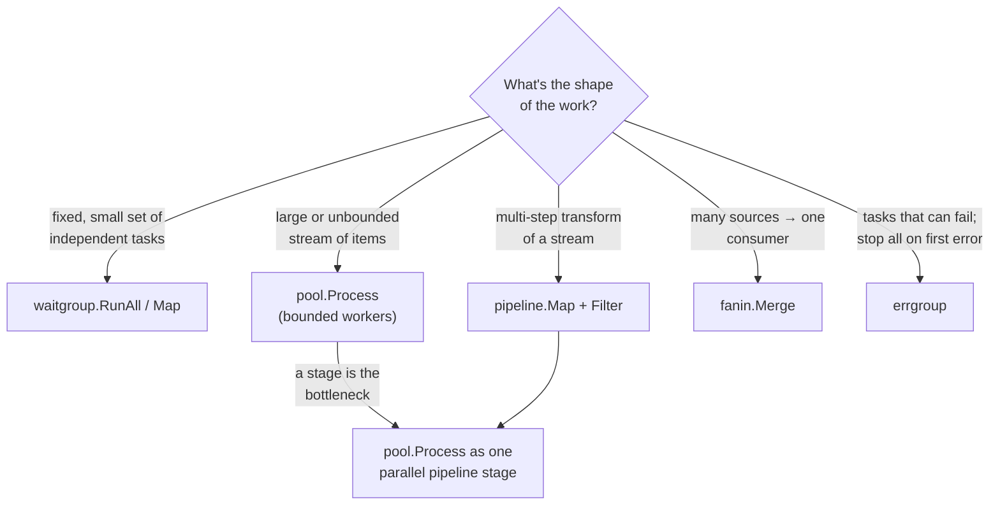

# Choosing the Right Primitive

Concurrency mastery is as much about *judgement* as mechanics: picking the
smallest tool that solves the problem. This page is a decision guide from
"I have a concurrency problem" to the specific primitive or pattern.

---

## The first question: do I even need concurrency?

Concurrency adds cost — scheduling, synchronization, and a whole new class of
bugs. Add it only for a **reason**: overlapping I/O latency, using multiple
cores for CPU-bound work, or modelling naturally independent activities. If a
simple sequential loop is fast enough, **that is the correct answer**.

---

## Communicate or protect? (the fork in the road)

Go's motto — *"Don't communicate by sharing memory; share memory by
communicating"* — is a **default**, not an absolute.

- **Channels** when a value has an *owner* that changes over time — work flowing
  through stages, results returning from workers. The channel *is* the handoff
  and the synchronization.
- **Mutex / atomic** when several goroutines read/write the *same* piece of state
  that stays put — a hit counter, an in-memory cache, a shared map. A mutex here
  is simpler and faster than routing every access through a goroutine + channel.

> Anti-pattern: wrapping a plain counter in a goroutine-with-channel "to be
> idiomatic". For a single integer, `atomic` or a `Mutex` is clearer and cheaper.

---

## Primitive cheat-sheet

| You want to… | Use | Notes |
|---|---|---|
| Wait for N known tasks to finish | `sync.WaitGroup` | `Add` before `go`; `defer Done` |
| Wait for N tasks **and collect a first error / cancel on failure** | `errgroup.Group` | cancels siblings on first error |
| Protect shared state (read+write) | `sync.Mutex` | keep critical sections tiny |
| Protect read-mostly state | `sync.RWMutex` | many readers, rare writers |
| Increment/read a single counter or flag | `sync/atomic` | no lock; one word only |
| Initialise something exactly once (lazy) | `sync.Once` | correct singleton, no torn init |
| Limit concurrency to N | buffered chan / `semaphore.Weighted` | counting semaphore |
| Deduplicate concurrent identical calls | `singleflight.Group` | one in-flight call, shared result |
| Cancel / deadline a call tree | `context.Context` | first arg; `defer cancel()` |
| Stream values producer→consumer | channel + generator | close on the sender side |
| Recombine many streams into one | fan-in (`fanin.Merge`) | closer goroutine after `WaitGroup` |
| Cap parallelism over many/unbounded items | worker pool (`pool.Process`) | `~NumCPU` for CPU-bound |
| Transform a stream in stages | pipeline (`pipeline.Map/Filter`) | each stage a goroutine |

---

## Pattern selection by shape of the problem

### Worked example

*"Fetch 10,000 URLs, parse each, keep the successful ones, aggregate."*

1. **10,000 items, network-bound, rate-limited** → **worker pool** with far more
   than `NumCPU` workers, capped at the API's rate limit (a **semaphore**).
2. **fetch → parse → filter** are distinct steps → a **pipeline**, with the fetch
   stage implemented as the parallel pool.
3. **stop everything if the context is cancelled** → thread `context.Context`
   through every stage; each `select`s on `ctx.Done()`.
4. **aggregate results** → **fan-in** the workers' outputs into one channel the
   aggregator ranges over.

That single problem exercises four patterns composing cleanly — which is the
whole point of building them as small, orthogonal packages.

---

## CPU-bound vs I/O-bound (sizing)

| | CPU-bound (hashing, parsing, math) | I/O-bound (network, disk, DB) |
|---|---|---|
| Bottleneck | CPU cores | wait time on the resource |
| Worker count | `~runtime.NumCPU()` | **many more** than cores |
| Why | more Gs than Ps only adds overhead | blocked Gs don't hold a P (see [scheduler](scheduler.md)) |
| Speedup ceiling | `GOMAXPROCS` (Amdahl's law) | downstream throughput / limits |

Guessing wrong is the #1 pool-sizing mistake. **Measure** — a later phase adds
speedup benchmarks to make the difference concrete.

---

**See also:** [Memory Model](memory-model.md) · [Scheduler](scheduler.md) ·
[Pitfalls & Anti-Patterns](pitfalls.md) · [Fundamentals](fundamentals.md) ·
[Worker Pools & Pipelines](pool-pipeline.md).
