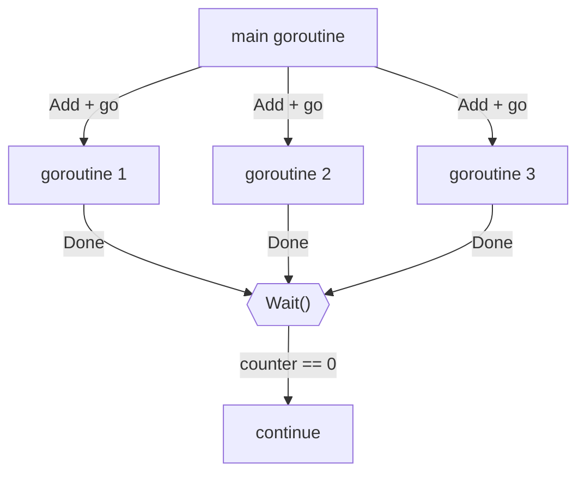
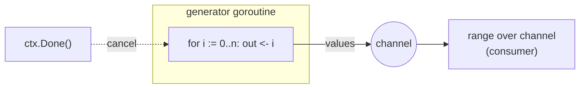
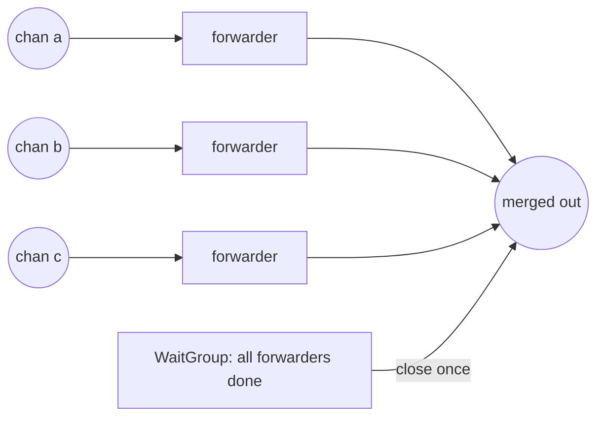
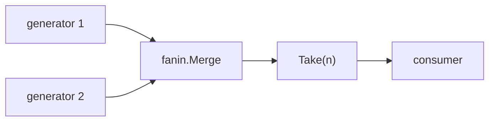

# Fundamentals

The building blocks every other pattern is made of: starting goroutines and
waiting for them, producing a stream of values, and recombining several streams
into one — all without data races or leaked goroutines.

---

## WaitGroup (`patterns/waitgroup`)

**What it is.** A `sync.WaitGroup` is a counter that lets one goroutine wait for
a group of others to finish. You `Add(n)` before launching, each goroutine calls
`Done()` when it finishes (idiomatically via `defer`), and `Wait()` blocks until
the counter hits zero.

**API.**
- `RunAll(tasks ...func())` — run each task in its own goroutine and block until
  all return. Nil tasks are skipped; `defer Done()` guarantees `Wait` returns
  even if a task panics.
- `Map[T, R](inputs, fn)` — run `fn` over every input in parallel and return
  results **in input order**. Each goroutine writes to a distinct slice index,
  so it is race-free without any locking.

**Pitfalls it avoids.**
- Calling `Add` *inside* the goroutine (a classic race — always `Add` before
  `go`).
- Forgetting `Done` on an early return or panic → `Wait` hangs forever.

**When to use.** A bounded, known set of independent tasks you want to fan out
and join. For large or unbounded work, cap the goroutines with a **worker pool**
(a later phase) instead of one goroutine per item.

---

## Generators (`patterns/generator`)

**What it is.** A generator is a goroutine that **produces a stream of values on
a channel** and closes it when finished — the *source* stage of a pipeline.

**API.**
- `Ints(ctx, n)` — emits `0..n-1` then closes.
- `FromSlice(ctx, s)` — turns a slice into a stream.
- `Take(ctx, in, n)` — forwards at most `n` values from another stream (a
  limiter for possibly-infinite generators).

**The two rules that keep it safe.**
1. **Only the generator closes the channel**, exactly once (`defer close(out)`),
   signalling end-of-stream to the consumer.
2. **Every send is guarded by `select { case out <- v: case <-ctx.Done(): }`**
   so that if the consumer walks away early, the producer is cancelled instead
   of blocking forever (a goroutine leak).

**When to use.** Whenever you want to model data as a lazy, streaming sequence
that downstream stages consume — logs, pages of results, generated work items.

---

## Fan-in (`patterns/fanin`)

**What it is.** Fan-in **merges several input channels into a single output
channel**. It's how you recombine the results of work that was fanned out across
many goroutines or generators.

**API.**
- `Merge[T](ctx, chans...)` — one forwarding goroutine per input copies values to
  a shared output; a single **closer goroutine** waits on a `WaitGroup` for all
  forwarders and then closes the output **exactly once**. Values are interleaved
  in arrival order (the merge is not ordered).

**Pitfalls it avoids.**
- **Double close** — closing the output from each forwarder would panic; a lone
  closer goroutine after `wg.Wait()` closes it once.
- **Leaks** — every forwarder selects on `ctx.Done()`, so cancelling the context
  tears the whole merge down cleanly.

**When to use.** The recombination half of a **fan-out/fan-in** pipeline: split
work across workers, then merge their outputs back into one stream.

---

## How they compose

Generators, fan-in and a WaitGroup are already a complete miniature pipeline:

Later phases build worker pools, multi-stage pipelines, and synchronization
primitives on top of exactly these fundamentals.
