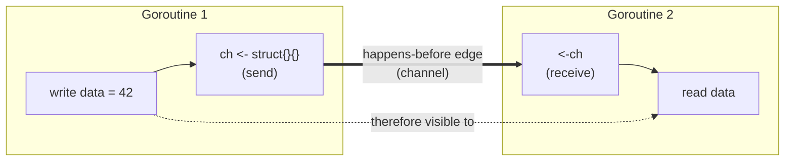

# The Go Memory Model & `happens-before`

> *"If you must read the rest of this document to understand the behavior of your
> program, you are being too clever. Don't be clever."* — The Go Memory Model

Every correct concurrent program rests on **one question**: when is a write made
by one goroutine *guaranteed* to be observed by a read in another goroutine? The
answer is the **Go memory model**, and mastering concurrency means reasoning in
its terms — `happens-before` — rather than in wall-clock time.

---

## Why wall-clock intuition is wrong

Goroutines do **not** see each other's memory operations in the order you wrote
them. Two things reorder your code:

1. **The compiler** may reorder instructions that are correct *within a single
   goroutine* (as-if-serial), even if that reordering is visible to another
   goroutine.
2. **The CPU** may reorder loads/stores and cache writes per-core, so core A can
   still see an old value that core B already overwrote.

```go
// Goroutine 1            // Goroutine 2
data = 42                 for !ready {}   // spin
ready = true              print(data)     // may print 0, NOT 42
```

Without synchronization there is **no `happens-before` edge** between the two
goroutines, so Goroutine 2 may observe `ready == true` while still seeing the
*old* `data == 0`. This is not theoretical — it happens on real hardware. The
fix is never "add a sleep"; it is to establish a `happens-before` relationship.

---

## The `happens-before` relation

`happens-before` is a **partial order** over memory operations. If event *A*
happens-before event *B*, then the effects of *A* are visible to *B*. Two rules:

- Within a **single goroutine**, `happens-before` is exactly program order.
- Across goroutines, edges are created **only** by synchronization primitives
  (channels, `sync`, `sync/atomic`). No primitive → no guarantee.

A **data race** is defined precisely: two accesses to the same variable, at
least one a write, **not ordered by `happens-before`**. A racy program is
**incorrect and has no guarantees of sequential consistency** — its behaviour
becomes non-deterministic, and the runtime may even abort it. (Unlike C/C++, Go
does *not* grant the compiler unlimited "undefined behaviour" freedom: a
single-word read still observes some actually-written value and values can't
appear out of thin air — but you must never rely on this instead of
synchronizing.)



---

## Where `happens-before` edges come from

### 1. Channels — the primary synchronization tool

| Rule | Guarantee |
|------|-----------|
| A **send** on a channel happens-before the corresponding **receive** completes. | Everything the sender did before the send is visible to the receiver. |
| The **close** of a channel happens-before a receive that returns zero (closed). | `close` safely publishes prior writes to all receivers. |
| On an **unbuffered** channel, the **receive** happens-before the **send completes**. | Rendezvous: both sides synchronize in *both* directions. |
| The *k*-th receive on a channel of capacity *C* happens-before the *(k+C)*-th send. | This is how a buffered channel of capacity *C* acts as a **semaphore**. |

That last rule is subtle and powerful: a buffered channel is a counting
semaphore, and the memory model backs it.

### 2. `sync.Mutex` / `sync.RWMutex`

For a mutex, the *n*-th call to `Unlock` happens-before the *(n+1)*-th `Lock`
returns. In practice: whatever you wrote inside a critical section is visible to
the next goroutine that acquires the lock. `RWMutex` additionally orders
`Unlock` (write) before subsequent `RLock` returns.

### 3. `sync.Once`

`once.Do(f)` guarantees `f` completes (and all its writes are visible) before any
`Do` call returns. This is why `Once` is the correct tool for lazy singletons —
no torn/partial initialization can leak out.

### 4. `sync/atomic`

Atomic operations are **sequentially consistent** in Go: an atomic write
happens-before an atomic read that observes it. Used correctly, an atomic store
can even *publish* the ordinary writes sequenced before it to a goroutine that
observes the store. But the atomicity itself covers only that **one word** — any
other shared state you touch must still be ordered by that synchronization; an
atomic counter next to a non-atomic map does not make the map safe.

### 5. Goroutine start & `WaitGroup`

- The `go f()` statement happens-before the start of `f` — the new goroutine sees
  everything set up before it was launched.
- `wg.Done()` happens-before the `wg.Wait()` it unblocks — results written before
  `Done` are visible after `Wait` returns. (This is exactly why
  [`waitgroup.Map`](../patterns/waitgroup/waitgroup.go) is race-free.)

> **Caution:** goroutine *exit* is **not** ordered relative to anything. You may
> not assume a goroutine has finished just because `main` reached a certain line;
> synchronize explicitly.

---

## Practical consequences

- **`-race` finds the *absence* of `happens-before`.** The race detector is a
  dynamic checker: it flags unsynchronized concurrent accesses it actually
  observes. Green under `-race` is strong evidence, not a proof — so this repo
  *also* designs for correctness, not just tests for it.
- **A single flag needs synchronization too.** A lone `bool` shared across
  goroutines is still a race; use `atomic.Bool` or a channel, never a bare read.
- **"It worked on my machine" means nothing.** Reordering is
  architecture-dependent (x86 is stricter than ARM). Reason with the model.

## How this library applies it

Every pattern here creates its visibility guarantees through **channels**,
`WaitGroup`, or `context` cancellation — never through timing:

- Generators publish each value via a **channel send** (edge to the receiver).
- Fan-in's closer goroutine uses `WaitGroup` so the final `close` is safely
  ordered after every forwarder's last send.
- Worker pools rely on channel send/receive edges so a result computed by worker
  *k* is visible to the consumer that receives it.

**Next:** [The Go Scheduler](scheduler.md) — how these goroutines actually get
mapped onto CPU cores.
