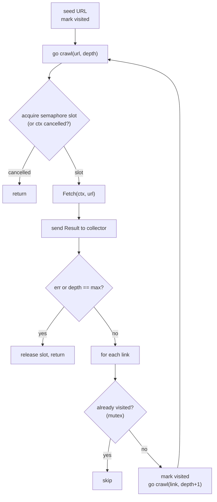
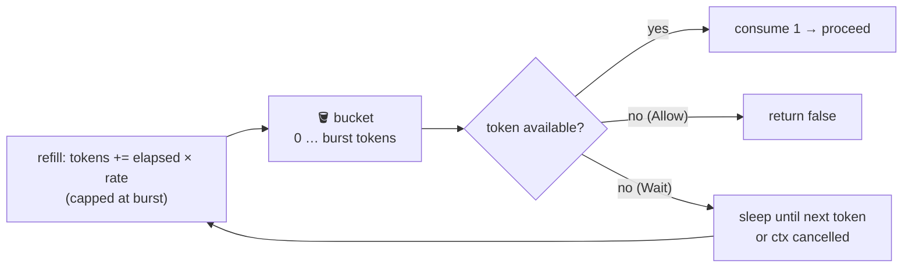
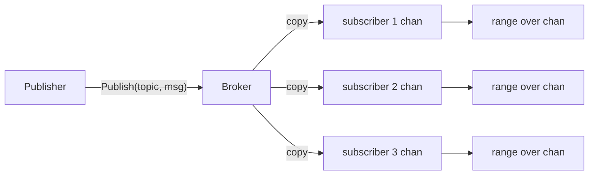
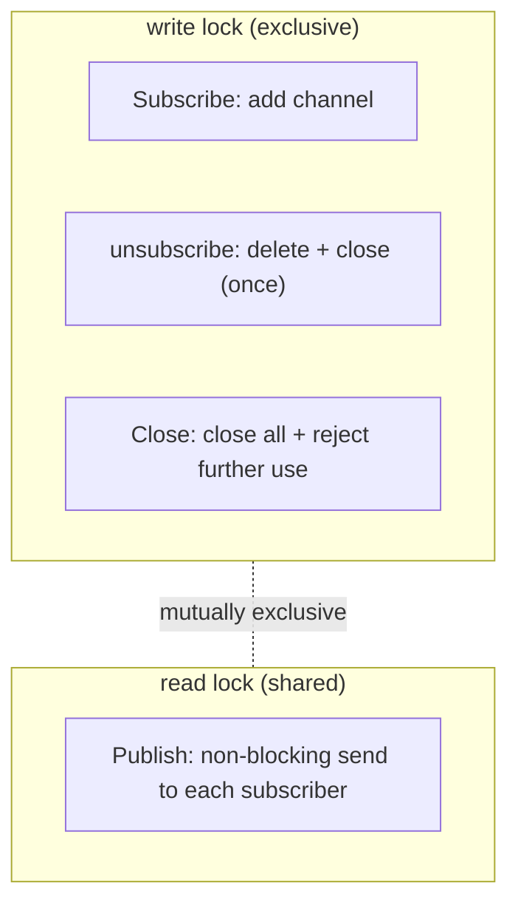

# Mini-Applications — patterns composed into real programs

The earlier pages each isolated *one* primitive. Real systems combine them. This
page walks through three compact applications that each fuse several patterns
into something you would actually ship: a **concurrent web crawler**, a
**token-bucket rate limiter**, and a **publish/subscribe broker**. Each is
decoupled from the outside world (an interface or an injectable clock), so it is
deterministic, offline-testable, race-clean, and leak-free.

| App | Patterns it composes | The hard problem it solves |
|-----|----------------------|----------------------------|
| [Crawler](#1-concurrent-web-crawler) | bounded parallelism (semaphore) + shared state (mutex) + `WaitGroup` + context cancellation | traverse a graph fast **without** re-visiting nodes, unbounded fan-out, or leaks |
| [Rate limiter](#2-token-bucket-rate-limiter) | lazy time-based state + cancellable blocking | bound how *often* work starts, with bursts, and no background goroutine |
| [Pub/Sub broker](#3-publishsubscribe-broker) | fan-out over channels + `RWMutex` close discipline + generics | deliver every message to every subscriber with **exactly-once close** |

---

## 1. Concurrent web crawler

**Goal:** visit every page reachable from a seed URL up to a depth limit, as fast
as the machine allows, but fetch each URL **exactly once** and never spawn an
unbounded number of in-flight requests.

It is decoupled from the network by a one-method interface, so tests and demos
drive it with an in-memory graph — deterministic and offline.

```go
type Fetcher interface {
    Fetch(ctx context.Context, url string) (links []string, err error)
}
```

### How the patterns combine

- A **buffered channel used as a counting semaphore** (`make(chan struct{}, workers)`)
  caps how many `Fetch` calls run at once — this is the [semaphore](synchronization.md)
  pattern bounding parallelism.
- A **mutex-guarded `visited` set** de-duplicates URLs so cycles terminate and no
  page is fetched twice — shared state protected by a lock, as the
  [memory model](memory-model.md) requires.
- A **`WaitGroup`** tracks the recursively spawned goroutines; a single closer
  goroutine runs `wg.Wait(); close(results)` so the collector's `range`
  terminates — the sender-closes rule from [the golden rules](README.md).
- Every blocking send and semaphore acquire is inside a `select` with
  `<-ctx.Done()`, so cancelling the context stops the crawl promptly and leaves
  **no goroutine behind** (verified by `goleak`).



### Bounded concurrency is the whole point

With *N* pages each taking time *d*, a serial crawl needs `~N*d`. Bounding
concurrency at *W* workers brings that down toward `~(N/W)*d` while guaranteeing
we never open more than *W* connections at once — the balance every real crawler
must strike between speed and politeness. The demo makes this visible:

```
$ demo crawler --workers 3 --delay 20
workers:  3
visited:  7 pages
elapsed:  63ms
serial:   ~140ms (estimated)
```

---

## 2. Token-bucket rate limiter

**Goal:** allow work to proceed at a steady average **rate** (e.g. 100
requests/second), while permitting short **bursts**, and refuse or delay the rest
— exactly what external APIs enforce.

A bucket holds up to `burst` tokens and refills at `rate` tokens per second. Each
unit of work consumes one token. `Allow()` is non-blocking (take a token or fail);
`Wait(ctx)` blocks until a token is available or the context is cancelled.

> **Semaphore vs rate limiter — a common confusion.** A [semaphore](synchronization.md)
> bounds *how many* things run **at once** (concurrency). A rate limiter bounds
> *how often* things may **start** (frequency). They answer different questions.



### The key design choice: lazy refill, no goroutine

A naive limiter starts a background ticker that adds tokens on a schedule — a
goroutine that must be stopped or it **leaks**. This implementation instead
computes the bucket level **lazily** from elapsed time on each call:

```
tokens += (now - last) × rate     // capped at burst
```

No goroutine, nothing to leak, and — because the clock is injectable — the
limiter is **fully deterministic under test** (a fake clock advances time by
hand). The demo shows the burst being spent immediately, then requests paced to
the sustained rate:

```
$ demo ratelimiter --requests 6 --rate 10 --burst 2
accepted immediately: 2/6 (burst=2)
Wait #3 -> sent at 100ms   # 10 tokens/sec ⇒ one every 100ms
Wait #4 -> sent at 200ms
```

---

## 3. Publish/subscribe broker

**Goal:** many subscribers register interest in a **topic**; each receives its own
copy of every message published to it, until it unsubscribes or the broker closes.
The whole challenge is **channel-close discipline** under concurrency.



### Why this is subtle: who closes, and when?

The [golden rule](README.md) is *the sender closes, exactly once, and never sends
on a closed channel*. Here the broker is the sole sender to every subscriber
channel, so it must also be the sole closer. Two things could break that:

1. A `Publish` sending to a channel that `unsubscribe`/`Close` just closed →
   **panic** (send on closed channel).
2. `unsubscribe` and `Close` both closing the same channel → **panic** (double
   close).

Both are prevented with an **`RWMutex` that inverts the usual roles**:

- `Publish` takes the **read** lock — many publishers may deliver concurrently.
- `Subscribe`, `unsubscribe`, and `Close` take the **write** lock — the only
  operations that mutate the topic map or close channels.

Because a writer excludes all readers, **no channel is ever closed while a send is
in flight**, and `sync.Once` inside each `unsubscribe` makes it idempotent. Since
delivery is synchronous under the read lock, the broker runs **no goroutines of
its own** and cannot leak.



### Non-blocking delivery: slow subscribers drop, not block

`Publish` sends with `select { case ch <- msg: default: }`. A subscriber whose
buffer is full simply **misses** that message rather than stalling the publisher
or the other subscribers — the standard back-pressure trade-off for a broadcast
bus (bounded memory, best-effort delivery).

---

## What ties them together

All three obey the same discipline the rest of the library teaches:

- **A seam to the outside world** (`Fetcher`, injectable clock, generic channel)
  makes them deterministic and testable offline.
- **Cancellation is first-class** — every blocking operation selects on
  `<-ctx.Done()`.
- **No goroutine outlives its purpose** — proven by `goleak` in every test.
- **Shared state is either communicated over channels or protected by a lock**,
  never touched racily — every test runs under `-race`.

See also: [Synchronization Primitives](synchronization.md) for the semaphore the
crawler reuses, [the Memory Model](memory-model.md) for why the mutex is
required, and [Choosing the Right Primitive](decision-guide.md) for when to reach
for each tool.
