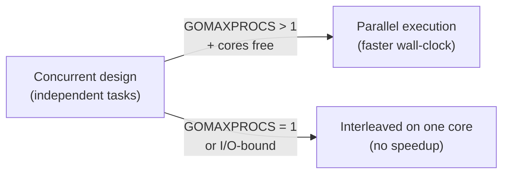
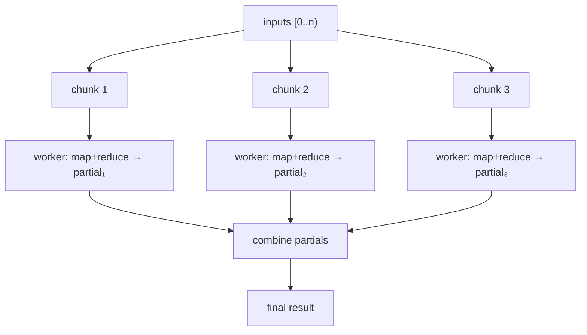
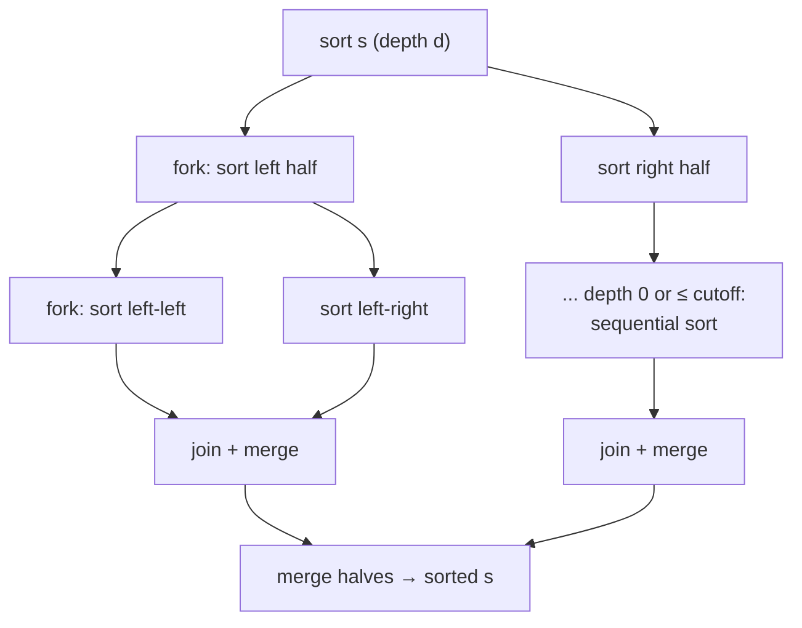

# Real Parallelism & Speedup

The earlier phases were about **concurrency** — *structuring* a program as
independent tasks. This phase is about **parallelism** — actually running those
tasks on multiple CPU cores at the same instant to finish faster, and
**measuring** the speedup instead of assuming it.

For the machinery that makes this possible, see [the scheduler](scheduler.md):
`GOMAXPROCS` sets how many goroutines run Go code in parallel, and the runtime
spreads them across cores. Here we put that to work with two classic
divide-and-conquer patterns and benchmark them.

---

## Concurrency enables parallelism — it doesn't guarantee it



Parallel speedup appears only when the work is **CPU-bound** (limited by
computation, not by waiting) and the tasks are **independent** (little shared
state, little coordination). If either fails, adding goroutines adds overhead,
not speed.

---

## Amdahl's law: the ceiling on speedup

If a fraction *p* of a program is parallelisable and *(1−p)* is inherently
serial, the best possible speedup on *N* cores is:

```
speedup(N) = 1 / ( (1 − p) + p/N )
```

Two consequences a master keeps in mind:

- **The serial part dominates.** Even with *p = 0.95* and infinite cores, the
  ceiling is 20×. Shaving the serial 5% matters more than adding cores.
- **Overhead and memory bandwidth are real.** Goroutine creation, merging
  results, and contention for shared memory all eat into *p*. That is why the
  measured speedups below are well under the core count.

---

## Parallel map-reduce (`patterns/mapreduce`)

**What it is.** Map a function over every element and fold the results into one
value, splitting the work across cores. The input is cut into contiguous
**chunks**, one per worker; each worker maps-and-reduces its chunk to a partial
on its own goroutine, and the partials are combined at the end.



**Correctness contract.** The reducer must be **associative** and `identity` its
neutral element. Associativity (not commutativity) is enough because chunks are
contiguous and combined left-to-right, so the result equals the sequential fold.
Each worker writes a **distinct** partial index, so no lock is needed.

**A subtlety worth knowing.** Floating-point addition is *not* associative, so a
parallel reduction of floats can differ from the serial sum by a rounding error.
That is not a bug — it is the nature of parallel reduction, and why the demo
compares with a relative tolerance.

**Measured** (10 cores, CPU-bound mapper):

```
$ go run ./cmd/demo mapreduce --n 200000
serial:   ~27 ms
parallel: ~5 ms
speedup:  ~5x
```

Compute-bound and independent → a large, real speedup.

---

## Parallel merge sort (`patterns/psort`)

**What it is.** The textbook **fork-join**: split the slice, sort the two halves
**concurrently**, then merge. Recursion forks a goroutine only down to a bounded
depth (so the number of goroutines stays near `GOMAXPROCS`, not the input size)
and switches to a fast sequential sort below a size cutoff, where goroutine and
merge overhead would dominate.



**Why the smaller speedup.** Sorting moves a lot of memory and the merge step is
partly serial, so it is **memory-bandwidth bound**, not purely compute-bound. Its
parallel fraction *p* is lower, so Amdahl's law caps the speedup well below the
core count:

```
$ go run ./cmd/demo psort --n 2000000
stdlib:   ~134 ms
parallel: ~94 ms
speedup:  ~1.4x
```

The contrast with map-reduce is the whole lesson: **not all parallelism is equal
— measure it.**

---

## How to measure speedup properly

- **Benchmark, don't guess.** Use Go's built-in tooling:
  `go test -bench . ./patterns/mapreduce/` and `.../psort/`. Each package ships a
  serial-vs-parallel benchmark pair.
- **Reset the timer** after setup and **exclude per-iteration setup** with
  `b.StopTimer()`/`b.StartTimer()` so you measure only the work.
- **Vary `GOMAXPROCS`** to see the effect of cores:
  `GOMAXPROCS=1 go run ./cmd/demo mapreduce` should show ~1× — proving the
  concurrent design only becomes parallel when cores are available.
- **Compare against the best serial baseline** (here, the standard library sort),
  not a naive one — a parallel algorithm that only beats a bad serial one isn't
  a win.

---

## When to reach for parallelism

| Good fit (expect speedup) | Poor fit (expect overhead) |
|---------------------------|----------------------------|
| CPU-bound: hashing, parsing, math, image work | I/O-bound: network, disk (use a [semaphore](synchronization.md)/pool for concurrency instead) |
| Independent items (map, reduce, sort) | Tightly coupled steps with shared mutable state |
| Large inputs amortising fork/merge cost | Small inputs where overhead dominates |

For choosing the right tool overall, see the [decision guide](decision-guide.md);
for the runtime that schedules it, [the scheduler](scheduler.md).
