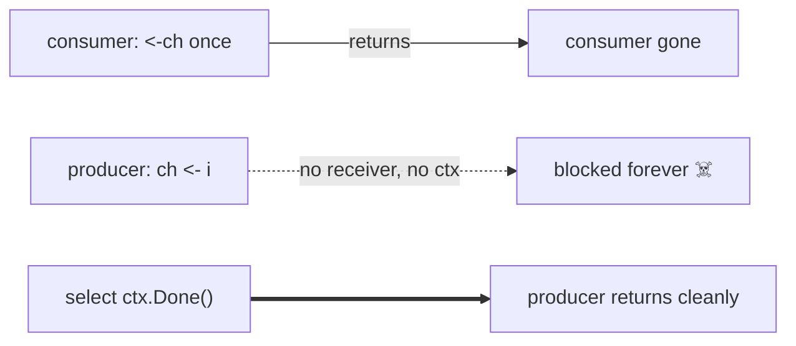

# Concurrency Pitfalls & Anti-Patterns

A catalogue of the bugs that bite real Go programs — with the **broken** version,
*why* it breaks, and the fix. Recognising these on sight is what separates
someone who *uses* goroutines from someone who *masters* them. Every fix here is
applied consistently across this library.

---

## 1. The data race on a shared variable

```go
// BROKEN — WaitGroup joins, but the writes race
var total int
var wg sync.WaitGroup
for _, n := range nums {
    wg.Add(1)
    go func(n int) { defer wg.Done(); total += n }(n) // ← concurrent read-modify-write
}
wg.Wait()
```

`total += n` is read-modify-write; concurrent goroutines interleave and lose
updates. `WaitGroup` orders *completion*, not the accesses in between.

```go
// FIX A — atomic for a single counter
var total int64
// ... atomic.AddInt64(&total, int64(n))

// FIX B — each goroutine writes a distinct slot, sum after Wait (no lock)
parts := make([]int, len(nums))
// ... parts[i] = n ; then sum parts after wg.Wait()
```

`go test -race` catches this immediately. FIX B is the technique behind
[`waitgroup.Map`](../patterns/waitgroup/waitgroup.go).

---

## 2. The goroutine leak (the silent killer)

```go
// BROKEN — consumer takes 1 value and returns; producer blocks forever
func first(ctx context.Context) int {
    ch := make(chan int)
    go func() {
        for i := 0; ; i++ {
            ch <- i // ← blocks forever once nobody receives → leaked goroutine
        }
    }()
    return <-ch
}
```

The producer is stuck on `ch <- i` after the single receive. It never exits: its
stack and captured memory leak, forever.

```go
// FIX — make the producer cancellable and select on ctx.Done()
select {
case ch <- i:
case <-ctx.Done():
    return
}
```

**Rule:** whoever starts a goroutine owns its shutdown. This is why every blocking
send in `generator`/`fanin`/`pool` selects on `ctx.Done()`, and why the tests use
`goleak` to *prove* no goroutine outlives them.



---

## 3. Closing a channel wrong

```go
ch <- v       // panic: send on closed channel
close(ch)     // panic: close of closed channel (double close)
```

Two panics, one rule: **only the sender closes, exactly once.** With multiple
senders, no single one may close — use a separate **closer goroutine** after a
`WaitGroup`, exactly as [`fanin.Merge`](../patterns/fanin/fanin.go) does. Never
close a channel to signal receivers to *stop sending*; use `context` for that.

---

## 4. Buffered vs unbuffered: choosing by accident

- **Unbuffered** (`make(chan T)`) — a **rendezvous**: send blocks until a receiver
  is ready. Gives you a synchronization point and natural **backpressure**.
- **Buffered** (`make(chan T, n)`) — send blocks only when the buffer is full.
  Decouples producer/consumer *up to n*. A buffer is **not** "make it faster"; a
  wrong-sized buffer hides backpressure and inflates latency/memory.

> Reach for a buffer for a *specific* reason — a known burst size, or a counting
> semaphore (`make(chan struct{}, limit)`). Default to unbuffered.

---

## 5. `select` gotchas

```go
// BROKEN — default turns a blocking wait into a busy spin
for {
    select {
    case v := <-ch: handle(v)
    default:        // ← fires constantly, pegging a CPU core
    }
}
```

`default` makes `select` **non-blocking**; in a loop with no other work it burns
100% CPU. Drop `default` to block until a case is ready.

Two more traps:
- **`nil` channel blocks forever.** A `case <-ch` where `ch == nil` is never
  selected — useful *intentionally* (disable a case by nilling it), a bug
  accidentally.
- **`select` picks randomly** among ready cases — never rely on ordering/priority.

---

## 6. The loop-variable capture (pre-Go 1.22)

```go
// BROKEN in Go ≤1.21 — all goroutines print the same final i
for i := 0; i < 3; i++ {
    go func() { fmt.Println(i) }() // captured by reference, shared i
}
```

Before Go 1.22 the loop variable was shared across iterations; the classic fix
was `i := i` shadowing or passing `i` as an argument. **Go 1.22 changed the
semantics** so each iteration has its own variable — this code is now correct.
This module targets Go 1.22+, so we rely on the new behaviour, but know both: you
*will* see the old idiom in interviews and legacy code.

---

## 7. Deadlock: everyone waiting, nobody sending

```go
ch := make(chan int) // unbuffered
ch <- 1              // fatal error: all goroutines are asleep - deadlock!
<-ch
```

A single goroutine sending on an unbuffered channel with no concurrent receiver
deadlocks instantly. The runtime detects **global** deadlock and panics; **partial**
deadlocks (some goroutines stuck) are silent leaks — see #2. Ordering-based
deadlocks (two goroutines each holding one lock, wanting the other) are avoided by
acquiring locks in a **consistent global order**.

---

## 8. `context` misuse

- **Don't store a `Context` in a struct** — pass it as the first argument,
  `ctx context.Context`, per stage/call.
- **Always call `cancel`.** `ctx, cancel := context.WithCancel(parent)` leaks the
  context's goroutine/timer if you never `defer cancel()`.
- **Cancellation is cooperative.** Cancelling a context doesn't *stop* a
  goroutine; the goroutine must *observe* `ctx.Done()`. A pool that ignores
  `ctx.Done()` keeps working after cancellation.
- **`context.Value` is for request-scoped data**, not for passing optional
  parameters — it's untyped and invisible to the compiler.

---

## 9. `WaitGroup` misuse

```go
go func() {
    wg.Add(1)      // ← BROKEN: Add may run after Wait already returned
    defer wg.Done()
    work()
}()
wg.Wait()
```

`Add` must happen **before** the `go` statement, on the parent goroutine —
otherwise `Wait` can observe a zero counter and return before the work is even
counted. Also: never copy a `WaitGroup` (or `Mutex`) after first use — pass a
`*sync.WaitGroup`. `go vet` flags lock copies.

---

## 10. Unbounded goroutine fan-out

```go
for _, req := range millionRequests {
    go handle(req) // ← a million goroutines: memory blow-up, thundering herd
}
```

"One goroutine per item" is fine for a handful and catastrophic for a million:
memory explodes and you DDoS the downstream service. Bound it with a **worker
pool** ([`pool.Process`](../patterns/pool/pool.go)) or a **semaphore**.

---

## The discipline, distilled

| Symptom | Root cause | This library's rule |
|---------|-----------|---------------------|
| Flaky results, `-race` fires | data race | synchronize via channel / atomic / lock; distinct write slots |
| Memory grows, goroutines climb | goroutine leak | every blocking op selects on `ctx.Done()`; `goleak` in tests |
| `panic: send/close on closed channel` | multiple/late closers | sender closes once; closer goroutine after `WaitGroup` |
| 100% CPU doing nothing | `select { default }` spin | block without `default` |
| Hang at startup/shutdown | deadlock | consistent lock order; cancellable channels |
| Works locally, fails in prod | reordering / timing assumption | reason with [`happens-before`](memory-model.md), not sleeps |

**See also:** [Memory Model](memory-model.md) · [Scheduler](scheduler.md) ·
[Choosing the right primitive](decision-guide.md).
