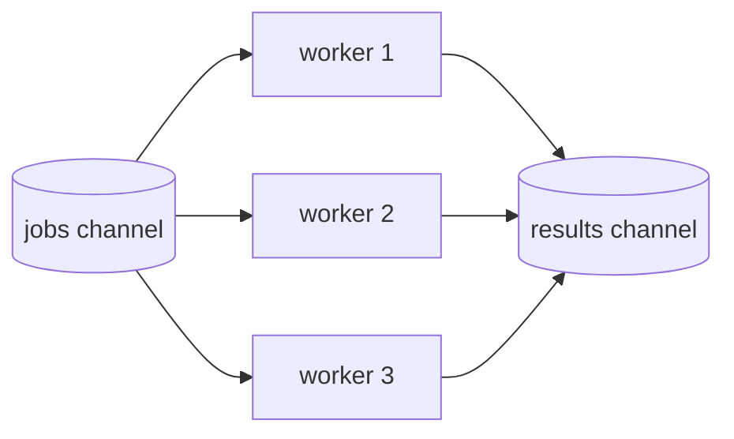
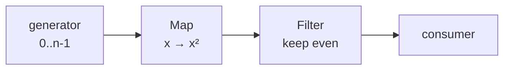

# Worker Pools & Pipelines

Two patterns for structuring stream processing: a **worker pool** bounds *how
many* things run at once, while a **pipeline** splits work into *stages* that run
concurrently. They compose — a pool can be one parallel stage of a pipeline.

---

## Worker Pool (`patterns/pool`)

**What it is.** A fixed number of worker goroutines that share a stream of jobs.
Instead of one goroutine per item (unbounded), you cap concurrency at *W*
workers. This is the standard way to get **controlled parallelism** without
exhausting CPU, memory, file descriptors, or a remote API's rate limit.



All workers read from the **same** input channel — Go's runtime hands each value
to whichever worker is free, giving automatic load balancing. A `WaitGroup` plus
a single closer goroutine closes the results channel exactly once, when every
worker has exited.

**API.**
- `Process[T, R](ctx, in, workers, fn)` — streaming: fan out `in` across
  `workers` goroutines and return a channel of results (**unordered**, in
  completion order). Composes directly with a `generator` source.
- `Map[T, R](ctx, inputs, workers, fn)` — batch: bounded parallel map over a
  slice, returning results **in input order**. Safe for very large inputs
  because concurrency is capped.

**How many workers?**
- **CPU-bound** work → around `runtime.NumCPU()` (more just adds scheduling
  overhead; real parallelism is capped by `GOMAXPROCS`).
- **I/O-bound** work (network, disk) → often many more than cores, because
  workers spend most time blocked waiting; tune to the downstream limit.

**When to use over `waitgroup.Map`.** `waitgroup.Map` spawns one goroutine per
item — fine for a handful. Use a pool when the item count is large or unbounded,
or when you must limit pressure on a shared resource.

---

## Pipeline (`patterns/pipeline`)

**What it is.** A chain of **stages** connected by channels; each stage is a
goroutine that receives from the previous stage, transforms values, and sends to
the next. Stages run concurrently, so while stage 2 handles item *N*, stage 1 is
already producing item *N+1* — like a factory assembly line.



**API.**
- `Map[I, O](ctx, in, fn)` — a stage that transforms each value (may change
  type), preserving order.
- `Filter[T](ctx, in, keep)` — a stage that forwards only values passing a
  predicate.

Because Go generics can't express a heterogeneous variadic chain, stages are
composed by **nesting**:

```go
out := pipeline.Filter(ctx,
          pipeline.Map(ctx, src, square),
          isEven)
```

**Why pipelines.**
- **Separation of concerns** — each stage does one thing and is trivially
  testable.
- **Concurrency for free** — stages overlap in time; a slow stage naturally
  applies backpressure to faster upstream ones through unbuffered channels.
- **Ordered & streaming** — values flow one at a time in order, with bounded
  memory (no need to materialise the whole sequence).

**Ordered stage vs parallel stage.** `pipeline.Map` is a single goroutine, so it
preserves order but processes one item at a time. When a stage is the
bottleneck, replace it with a **parallel stage** using `pool.Process` (trading
ordering for throughput).

---

## The golden rules (again)

Both patterns rely on the same discipline from the [fundamentals](fundamentals.md):
the **sender closes** its output channel exactly once (here, via a closer
goroutine after `WaitGroup.Wait`), and **every blocking send/receive selects on
`ctx.Done()`** so the whole pool or pipeline can be torn down without leaking
goroutines. Every test runs under `-race` and `goleak` to prove it.
