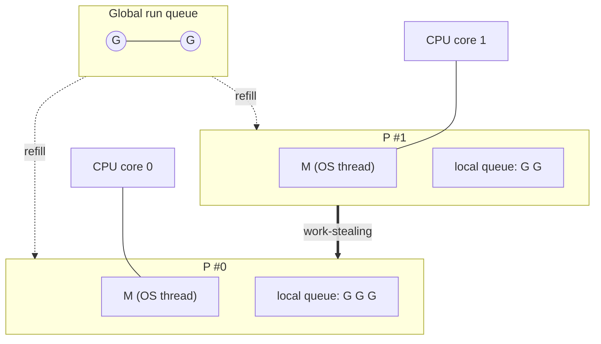
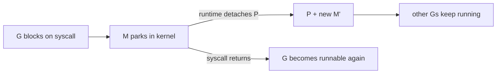

# The Go Scheduler (G-M-P Model)

Goroutines feel like magic — you launch hundreds of thousands of them and it just
works. Understanding *why* is a hallmark of concurrency mastery: it tells you how
many workers to spin up, why a blocking syscall doesn't stall your program, and
what `GOMAXPROCS` really controls.

---

## Goroutines are not OS threads

| | OS thread | Goroutine |
|---|---|---|
| Created by | the kernel | the Go runtime |
| Initial stack | ~1–8 MB (fixed) | ~2 KB (**grows/shrinks** on demand) |
| Scheduling | preemptive, by the kernel | cooperative + preemptive, by the runtime |
| Context switch | ~1–2 µs (kernel trap) | ~tens of ns (user space) |
| Practical limit | thousands | **millions** |

Because a goroutine starts at ~2 KB and switches in user space, "one goroutine
per unit of work" is cheap — but *not free*. Stacks still cost memory and the
scheduler still costs cycles, which is exactly why **worker pools** exist: to cap
concurrency when work is large or unbounded.

---

## The three actors: G, M, P

The runtime multiplexes many **G**s onto few **M**s using **P**s as the pieces
that grant permission to run.

- **G — goroutine.** A unit of work: its stack, program counter, and state.
- **M — machine.** An OS thread; the only thing that can actually execute code on
  a CPU.
- **P — processor.** A scheduling context holding a **local run queue** of
  runnable Gs. **An M must hold a P to run Go code.** The number of Ps is
  `GOMAXPROCS` — by default derived from the logical CPUs available to the
  process (honouring CPU affinity and, on Linux, the container's cgroup CPU
  quota), and adjustable at runtime.

**GOMAXPROCS = number of Ps = maximum goroutines running Go code in parallel.**
It is the dial that turns concurrency into parallelism. More goroutines than Ps
is fine — they wait in run queues; only `GOMAXPROCS` run at any instant.

---

## How a goroutine gets to run

1. `go f()` creates a **G** and pushes it onto the current P's **local run
   queue** (fast, lock-free for the common case).
2. A P's M pops a G from its local queue and runs it.
3. When the local queue empties, the P **steals** half the Gs from another P's
   queue (**work-stealing**), or pulls a batch from the **global queue**. This
   keeps all cores busy without central contention.
4. Periodically the scheduler checks the global queue and the network poller so
   no G starves.

### Blocking is handled transparently

This is the part that makes Go feel effortless:

- **Blocking syscall** (e.g. a file read). The M enters the kernel and *parks*.
  The runtime **detaches the P** from that M and hands it to another M so the
  other Gs on that P keep running. When the syscall returns, the G is rescheduled.
  → A blocked syscall costs you one thread, **not** your whole program.
- **Blocking on a channel / mutex / `select`.** No kernel involved — the runtime
  simply parks the G and runs the next one on the same M. When the channel is
  ready, the G becomes runnable again. This is why blocking on channels is *cheap*
  and idiomatic, not something to avoid.
- **Network I/O.** The runtime's **netpoller** parks the G and uses the OS's
  event mechanism under the hood (epoll on Linux, kqueue on BSD/macOS, IOCP on
  Windows), so tens of thousands of goroutines can each "block" on a socket
  while only a handful of Ms exist.

---

## Preemption: why one goroutine can't hog a core

Early Go relied on **cooperative** scheduling — a G yielded only at function
calls, channel ops, etc. A tight loop with no calls (`for {}`) could monopolize a
P forever. Since **Go 1.14**, the runtime uses **asynchronous preemption**: it
signals a running G (via an OS signal) and makes it yield at a safe point
(targeting roughly a ~10 ms time slice), so even a tight CPU-bound loop no longer
monopolizes a P indefinitely or stalls the GC. Preemption is approximate, not a
hard real-time guarantee.

---

## What this means for your code

- **Sizing worker pools.**
  - **CPU-bound** work → about the current parallelism limit,
    `runtime.GOMAXPROCS(0)` (often equal to `runtime.NumCPU()`, but not when a
    container quota or explicit setting lowers it). More Gs
    than Ps just adds scheduling overhead; the cores are already saturated.
  - **I/O-bound** work → many *more* than `NumCPU()`. Blocked Gs don't occupy a
    P, so you scale to the *downstream* limit (connection pool, rate limit), not
    the core count.
- **`GOMAXPROCS` is your parallelism ceiling.** Setting it to 1 makes code
  concurrent but not parallel — a great way to *demonstrate* the difference (and
  to expose races that only appear when timing changes).
- **Don't fear blocking on channels.** It parks a G, not a thread. "Avoid
  blocking" is a myth born from thread-based languages.
- **Goroutines are cheap, not free.** Leaking them (a G blocked forever) leaks
  its stack and anything it references — hence this repo's `goleak` discipline.

**See also:** [The Go Memory Model](memory-model.md) for *visibility* guarantees,
and [Choosing the Right Primitive](decision-guide.md) for sizing pools in
practice. Measuring the speedup the scheduler makes possible (parallel map-reduce,
speedup benchmarks) arrives in a later phase.
