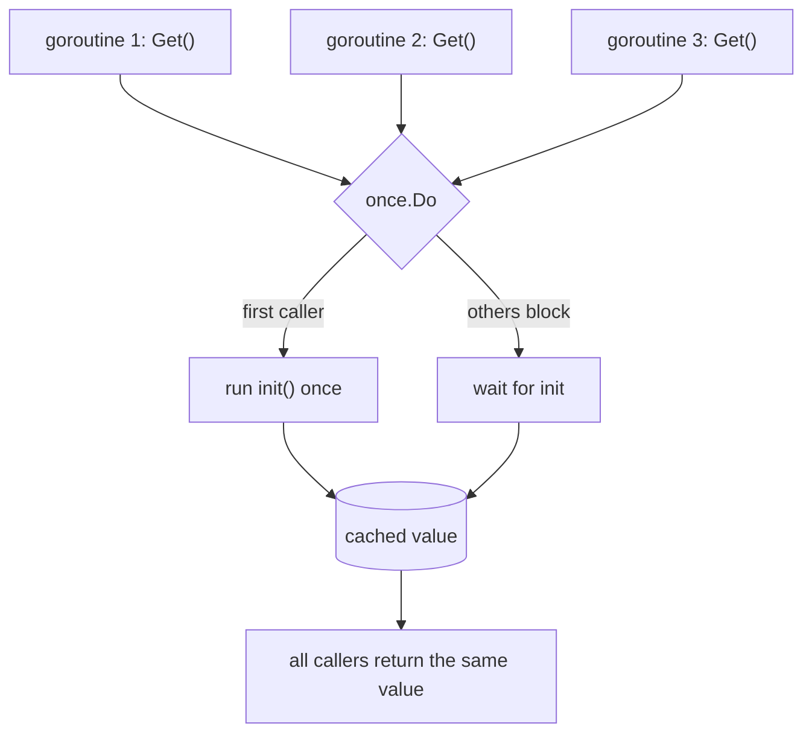
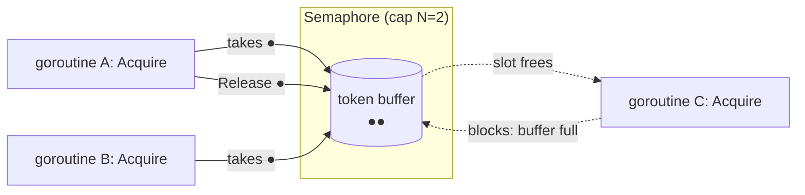
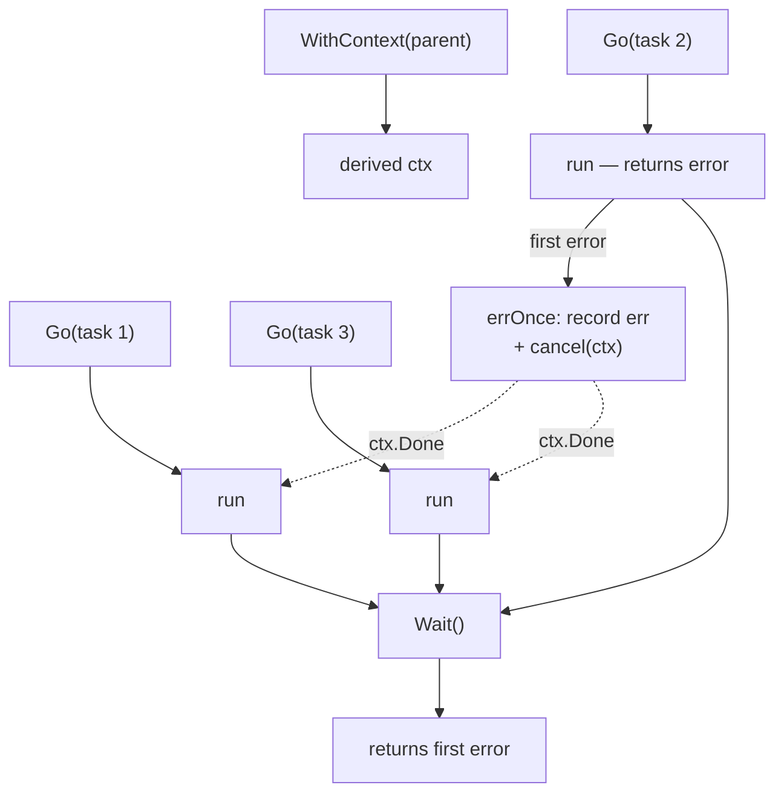
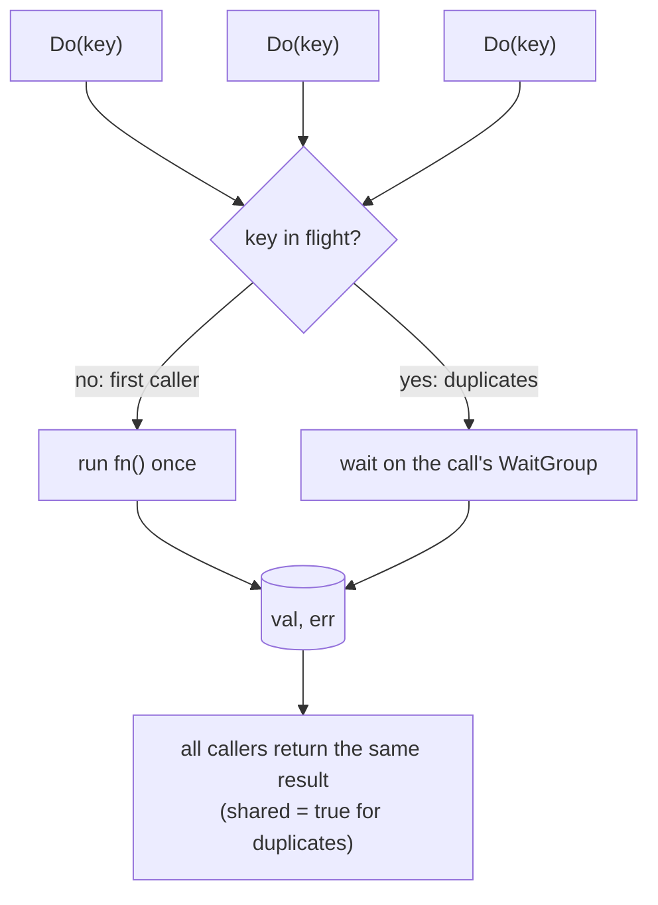

# Synchronization Primitives

Beyond passing values along channels, real programs need to **coordinate**:
initialise something once, cap how many goroutines touch a resource, wait for a
group of tasks and react to the first failure, or make sure a thousand
simultaneous requests for the same thing only do the work once. This phase builds
each of these as a small, reusable, generic package — **from primitives**, so the
mechanism is visible rather than hidden behind a library.

Every one rests on the guarantees in the [memory model](memory-model.md): the
`happens-before` edges created by `sync.Once`, `Mutex`, `WaitGroup`, buffered
channels, and `context` cancellation.

---

## Lazy initialization (`patterns/once`)

**What it is.** A value computed **exactly once**, on first use, then shared by
all callers — a thread-safe memoized singleton. `Lazy[T]` wraps `sync.Once`,
whose contract is precisely what lazy init needs: the initializer runs a single
time, and its writes are visible to every later `Get` with no partial state ever
observable.

**Why not a plain `if v == nil`?** A check-then-set across goroutines is a data
race and can run the initializer twice (or observe a half-built value). `sync.Once`
provides the `happens-before` edge that a bare nil-check lacks.

**When to use.** Expensive, idempotent setup shared program-wide: a parsed
config, a compiled regexp, a connection pool, a client singleton.

---

## Counting semaphore (`patterns/semaphore`)

**What it is.** A permit counter that lets at most *N* goroutines proceed at
once; the rest block until a permit frees up. It is the direct application of the
memory-model rule that **a buffered channel of capacity N is a counting
semaphore**: sending a token acquires a slot, receiving one releases it.

**API.** `Acquire(ctx)` (blocking, cancellable), `TryAcquire()` (non-blocking),
`Release()`. `Acquire` selects on `ctx.Done()`, so a goroutine waiting for a
permit can always be cancelled instead of blocking forever.

**Semaphore vs worker pool.** A [worker pool](pool-pipeline.md) *owns* its
goroutines and feeds them work; a semaphore *bounds* goroutines you launch
yourself. Use a pool to process a stream through fixed workers; use a semaphore to
throttle access to a shared resource (a DB connection limit, an API rate cap)
from arbitrary call sites.

---

## errgroup-style task group (`patterns/group`)

**What it is.** Run a set of goroutines, wait for them all, collect the **first
error**, and — with `WithContext` — **cancel the siblings** as soon as one fails.
It is assembled from three primitives: a `WaitGroup` to join, a `sync.Once` so the
first error wins exactly once, and a `context.CancelFunc` to signal the rest.

**Cancellation is cooperative.** The group *cancels the context*; each task must
`select` on `ctx.Done()` to actually stop early. A task that ignores the context
runs to completion (its error, if any, simply won't be the first).

**When to use.** "Do these N things concurrently; if any fails, abort the rest and
report why" — parallel fetches, fan-out validation, concurrent stage startup.
This is the pattern `golang.org/x/sync/errgroup` standardises; building it shows
exactly how it works.

---

## Single-flight de-duplication (`patterns/singleflight`)

**What it is.** When many goroutines ask for the **same key at the same time**,
run the expensive function **once** and give every caller that one result. This is
the cure for the **thundering herd** / **cache stampede**: a hot cache entry
expires and a thousand requests would otherwise all recompute it at once.

**How it works.** A mutex-guarded `map[K]*call` tracks in-flight calls. The first
caller for a key becomes the *owner*, creates a `call` with a `WaitGroup`, runs
`fn`, then wakes the waiters. Duplicates find the existing `call`, block on its
`WaitGroup`, and read the shared result. The key is removed as soon as `fn`
returns — this is a **de-duplicator, not a cache** (pair it with a cache for
memoization).

**When to use.** Deduplicating concurrent identical work: cache-miss fills,
config reloads, token refreshes, any idempotent-but-expensive lookup hit by a
burst of identical requests.

---

## Choosing between them

| Need | Reach for |
|------|-----------|
| Build something once, share it | `once.Lazy` |
| Limit concurrent access to a resource | `semaphore.Semaphore` |
| Run N tasks, stop all on first error | `group.Group` (`WithContext`) |
| Collapse duplicate concurrent calls | `singleflight.Group` |

See the [decision guide](decision-guide.md) for how these fit alongside channels,
mutexes, and the pool/pipeline patterns.

---

## The discipline (again)

Each package keeps this repo's rules: the visibility of every shared write is
established by a real synchronization primitive (`Once`, `Mutex`, `WaitGroup`,
buffered channel), never by timing; every blocking wait selects on `ctx.Done()`
where cancellation applies; and every test runs under `-race` and `goleak` to
prove there are no races and no leaked goroutines.
